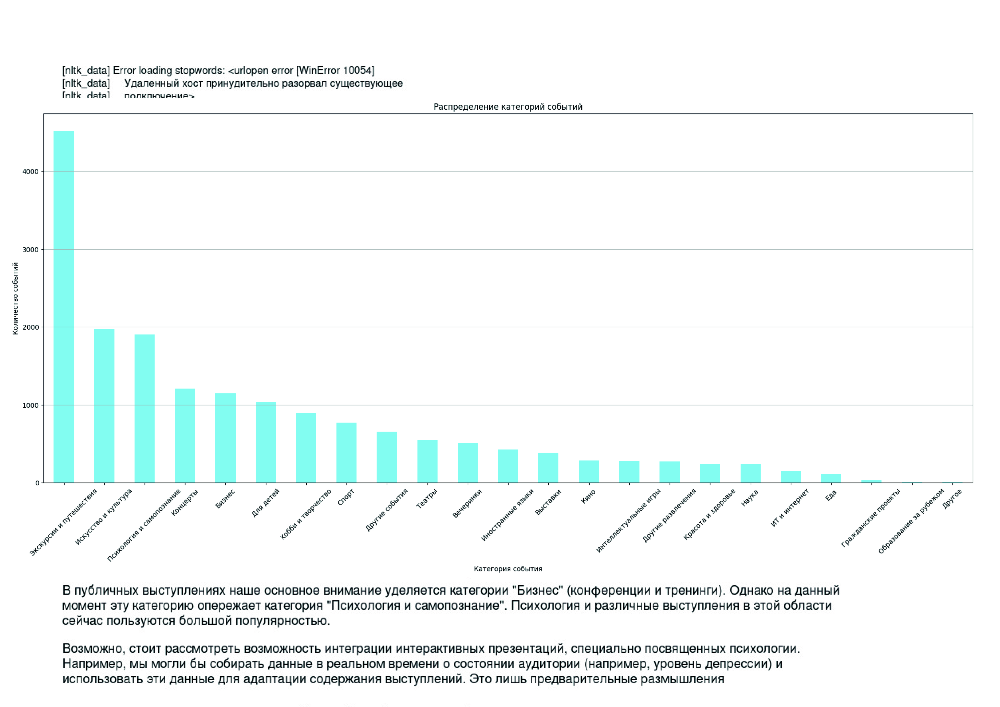
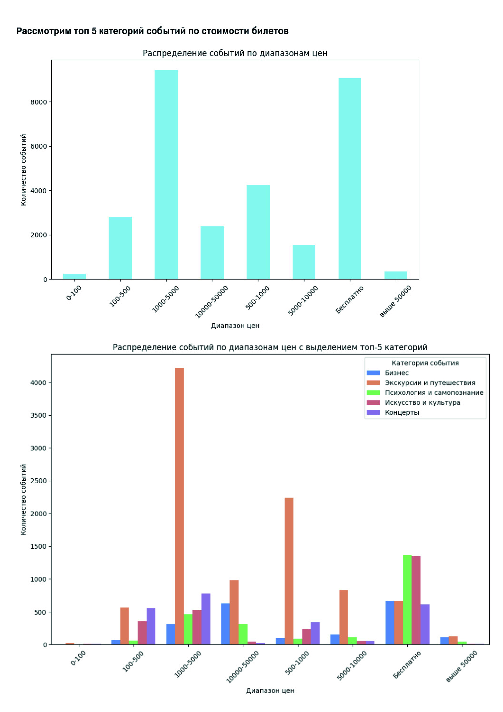

# Парсер мероприятий Timepad + EDA

Учебный проект по парсингу и анализу данных о мероприятиях с платформы [Timepad](https://timepad.ru/).  
Задача: извлечь данные о событиях (название, дата, место проведения и др.), сохранить их в структурированном виде и провести первичный разведочный анализ (EDA).

## Основные этапы проекта

1. **Парсинг**
   - Источник: сайт Timepad;
   - Инструменты: `requests`, `BeautifulSoup`;
   - Данные: название мероприятия, дата, город, ссылка на страницу.

2. **Обработка данных**
   - Сохранение данных в `pandas.DataFrame`;
   - Очистка и нормализация дат, преобразование текстовых полей;
   - Экспорт в формат CSV.

3. **Exploratory Data Analysis (EDA)**
   - Подсчет количества мероприятий по датам и городам;
   - Визуализация распределений (например, количество событий по месяцам);
   - Выявление самых популярных локаций и тематик.

## Используемые технологии

- Python 3.x  
- [Requests](https://docs.python-requests.org/)  
- [BeautifulSoup4](https://www.crummy.com/software/BeautifulSoup/)  
- [Pandas](https://pandas.pydata.org/)  
- [Matplotlib](https://matplotlib.org/) / [Seaborn](https://seaborn.pydata.org/)  

## Визуализации и выводы

### Распределение категорий мероприятий

Наибольшее количество событий приходится на категории **«Экскурсии и путешествия»** и **«Искусство и культура»**. Популярными также являются **«Психология и самопознание»**, концерты и бизнес-тренинги. Это показывает концентрацию культурной и образовательной активности.

---

### Онлайн и офлайн форматы

Во многих категориях офлайн-мероприятий заметно больше, чем онлайн. Однако в «Психологии и самопознании» и «Бизнесе» онлайн-формат занимает значимую долю, что говорит о востребованности дистанционного участия.

---

### Стоимость билетов

Большинство мероприятий попадает в диапазон **1000–3000 рублей** или проводится **бесплатно**. Высокая цена встречается реже, что указывает на ориентацию платформы на массового пользователя.

---

### Тематики внутри категорий
#### Психология

Ключевые слова: «собеседование», «обучение», «психотерапия», «супервизия». Это отражает фокус на образовательных и терапевтических программах.

#### Бизнес

Чаще всего встречаются слова «тренинг», «альянс», «движение», «развитие». Это указывает на сетевые мероприятия, конференции и практические тренинги.

## Итоги анализа

- События на Timepad имеют выраженную **сезонность** и концентрируются в крупных городах.  
- Основные категории: **экскурсии и путешествия, искусство и культура, психология и бизнес**.  
- **Офлайн-формат** по-прежнему доминирует, но в образовательных и психологических проектах растет доля онлайн.  
- По цене большая часть мероприятий доступна: от **1000–3000 рублей** либо бесплатно.  
- Тематический анализ показал:  
  - в «Психологии» преобладают курсы и супервизии;  
  - в «Бизнесе» — тренинги, встречи и развитие компаний.  

Таким образом, Timepad отражает современный баланс между культурными, образовательными и деловыми событиями, где заметно расширяется онлайн-сегмент.
